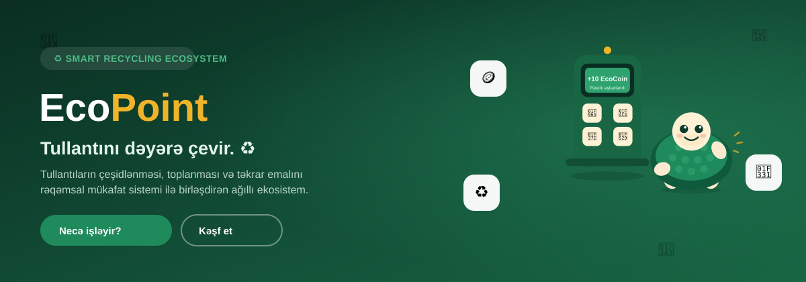

<p align="center">
  
</p>

<h1 align="center">EcoPoint — Smart Recycling Ecosystem</h1>

<p align="center">
  Tullantını dəyərə çevir. ♻️<br>
  <sub>Ağıllı tullantı idarəetmə ekosisteminin konseptual təqdimat saytı</sub>
</p>

<p align="center">
  <a href="https://salman98745.github.io/ecopoint/"></a>
  
  
  
</p>

<p align="center"><b>🔗 <a href="https://salman98745.github.io/ecopoint/">salman98745.github.io/ecopoint</a></b></p>

---

## Nədir?

**EcoPoint** şəhərlərdə tullantıların çeşidlənməsini, toplanmasını və təkrar emalını rəqəmsal mükafat sistemi ilə birləşdirən ağıllı tullantı idarəetmə ekosistemi konseptidir.

Bu repo **funksional bir tətbiq deyil** — layihənin nə olduğunu, hansı problemi həll etdiyini, necə işlədiyini və gələcək vizyonunu izah edən **tək-səhifəlik təqdimat saytıdır**. Sayt tamamilə Azərbaycan dilindədir.

> Saytda görünən tətbiq ekranları, EcoPoint məntəqəsi interfeysi, biznes paneli, leaderboard və statistika rəqəmləri yalnız illüstrativ vizual nümunələrdir. Real qeydiyyat, ödəniş, verilənlər bazası və ya backend mövcud deyil.

## ✨ Saytda nə var

| Bölmə | Təsvir |
|---|---|
| 🏠 Hero | Layihənin əsas mesajı və vizual təqdimatı |
| ⚠️ Problem | Çeşidlənməyən tullantının yaratdığı problemlər |
| 💡 Həll | EcoPoint-un işləmə axını (flow) |
| ♻️ Ağıllı məntəqə | Canlı simulyasiya olunan EcoPoint stansiyası |
| 📱 Tətbiq | İllüstrativ mobil tətbiq mockup-ları |
| 🐢 Tosbik | Layihənin rəqəmsal maskotu (custom SVG) |
| 🎮 Gamification | EcoCoin, reytinq, nailiyyətlər |
| 🎓 EcoUniversity Challenge | Universitetlərarası nümunəvi leaderboard |
| 🪙 EcoCoin | Rəqəmsal mükafat sisteminin izahı |
| 🤝 Tərəfdaşlar | Yerli biznes əməkdaşlıq modeli |
| 🏢 Biznes üçün | B2B tullantı idarəetmə paneli (mockup) |
| 💰 Business model | 6 gəlir kanalı |
| 🌍 Ekosistem | Bütün tərəfləri birləşdirən diaqram |
| 📊 Ekoloji təsir | Layihənin hədəflədiyi potensial təsir |
| 🚀 Gələcək vizyon | Böyümə istiqamətləri |

## 🧱 Texnologiya

Xalis **HTML5 + CSS3 + vanilla JavaScript** — heç bir framework, build addımı və ya backend yoxdur.

- Scroll-reveal animasiyaları (`IntersectionObserver`)
- Animasiyalı say counter-ları
- Custom SVG Tosbik maskotu (4 emosiya: salamlama, sevinc, kubok, yarpaq)
- Tam responsiv dizayn (mobil, tablet, desktop)

## 📁 Struktur

```
ecopoint/
├── index.html              # Bütün bölmələr
├── assets/
│   ├── css/style.css        # Dizayn sistemi
│   └── js/script.js         # Animasiyalar və interaktiv mock-lar
└── docs/
    └── banner.svg            # README banner
```

## 🚀 Lokal işə salmaq

Heç bir asılılıq (dependency) tələb olunmur — sadəcə statik faylları serve edin:

```bash
git clone https://github.com/Salman98745/ecopoint.git
cd ecopoint
python3 -m http.server 8080
```

Sonra brauzerdə `http://localhost:8080` açın.

## 📄 Qeyd

Bu layihə tədris/portfolio məqsədli konseptual bir təqdimatdır. Login, qeydiyyat, real EcoCoin əməliyyatları, QR skaner və verilənlər bazası kimi funksional komponentlər qəsdən yaradılmayıb — məqsəd ideyanı vizual və aydın şəkildə çatdırmaqdır.
